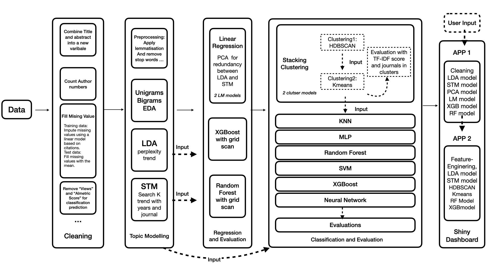

# Journal Abstract Analysis

This study presents a framework that combines structural topic modelling (STM) and latent Dirichlet allocation (LDA), with machine learning classifiers while integrating multiple clustering algorithms, to predict both the number of citations a paper will receive and the most suitable journal for submission. Additionally, two interactive dashboards are provided to allow users to input paper abstracts and obtain predictions using different models.
The work flows are shown as below:



More information can be checked in reports:

[Where Will Your Paper Go? Predicting Journal Submission and Citations with Topic Models](https://github.com/phy-guanzh/Paper_Journal_Classification/blob/main/Where_Will_Your_Paper_Go__Predicting_Journal_Submission_and_Citations_with_Topic_Models.pdf)


##  Quick Run on Online Dashboard

1. [Predict your target journal before submission](http://yhj0vi-zhe-guan.shinyapps.io/target_journal_dashboard)
2. [Predict your citation number](https://yhj0vi-zhe-guan.shinyapps.io/Citation_dashboard/)    
3. [Word Clouds](http://yhj0vi-zhe-guan.shinyapps.io/Top100_Key_Words_Dashboard).


## 📋 Repository Structure

The framework is based on **R Studio** version 4.4.1.

```shell
git clone https://github.com/phy-guanzh/Journal_Abstracts_Analysis.git
```


The main structure is as follows:

```
.
├── Plots
├── R
├── backup
├── citation_dashboard
├── rsconnect
├── target_journal_prediction
├── Citation_Prediction.Rmd
├── Citation_dashboard.Rmd
├── Classification.Rmd
├── Clustering.Rmd
├── Pre_processing.Rmd
├── README.md
└── journal_data.csv
```


1. directory **citation_dashboard** provides a dashboard with trained data to predict citation number

2. directory **target_journal_prediction** provides a dashboard with trained data to predict target journal
      
#### Trained models for citation regression include:

```shell
    ├── models
    │   ├── best_lm_model.rds
    │   ├── best_rf_model.rds
    │   ├── best_xgb_model.rdsrocessing.Rmd
    │   ├── dtm_model.rdsion_Prediction.Rmd
    │   ├── dtm_model_K6.rdsering.Rmd
    │   ├── fill_views_lm.rdsification.Rmd
    │   ├── lda_model_2000_2022_k10.rds
    │   ├── pca_model.rds
    │   └── xgb_grid_tuning.rds
 ```

#### Trained models for target journal classification include:
```shell
 ├── classification_model   
 │   ├── dtm_model.rds      
 │   ├── dtm_model_K6.rds   
`│   ├── hdbscan_model.pkl
 │   ├── kmeans_model.rds   
 │   ├── lda_model_2000_2022
 │   ├── model_lg.rds        
 │   ├── nn_model.rds1. 
 │   ├── rf_model.rds2. 
 │   ├── svm_model.rds      
 │   └── xgb_model.rds      
```

### 🚀 How to Run the R Markdown File

To run the R Markdown file in **RStudio**, follow these steps:

Open the `.Rmd` file in **RStudio**.

Click the **"Knit"** button at the top of the RStudio interface.

